# DrawFlow

A modern, web-based drawing app for visualizing ideas with an infinite canvas, hand-drawn styling, and real-time collaboration via WebSockets.

<div align="center">

https://github.com/user-attachments/assets/a2b3011f-3b12-4a2b-b92e-4d9f9c505d21

</div>

## Tech Stack

| Layer | Technology |
|-------|-----------|
| Frontend | Next.js 16, React 19, Tailwind CSS 4, Radix UI, Zustand |
| Backend | Node.js WebSocket server (ws) |
| Persistence | Redis |
| Monorepo | Turborepo, pnpm workspaces |
| Language | TypeScript |

## Screenshots

**Landing Page**

| | |
|---|---|
| 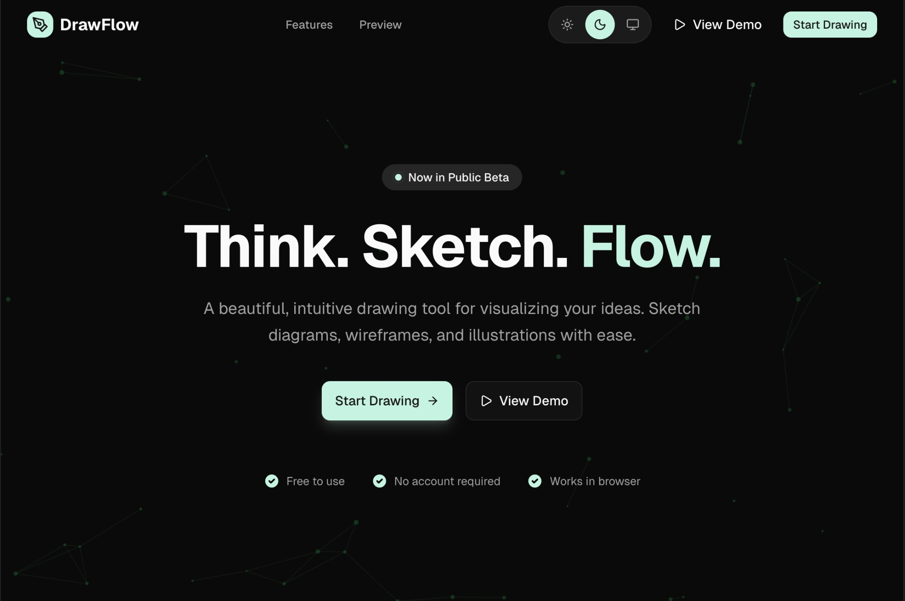 | 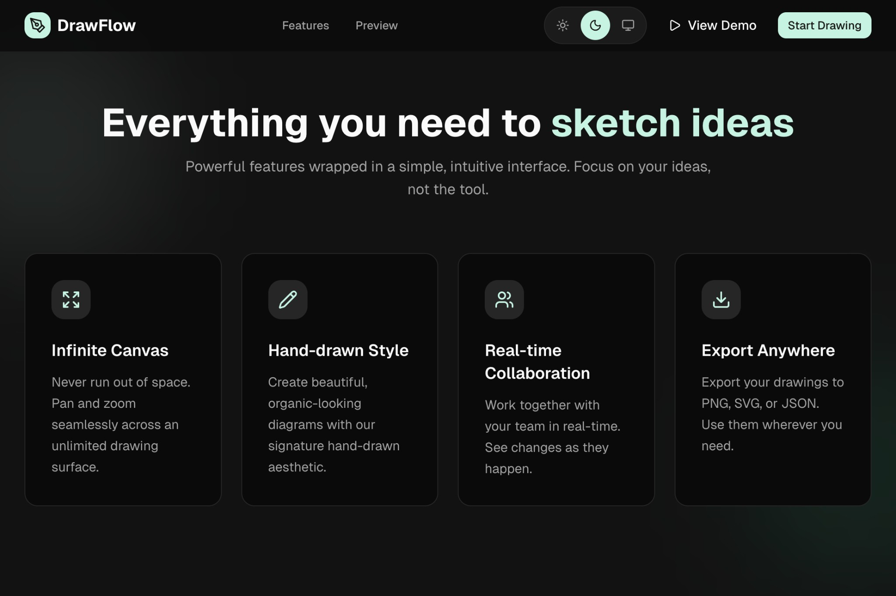 |
| 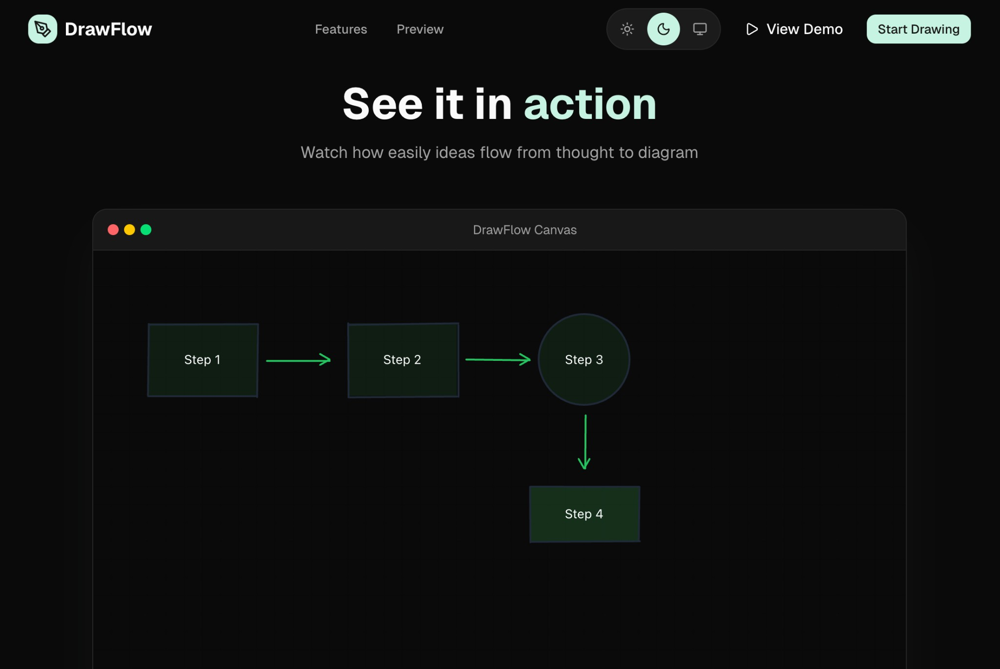 | 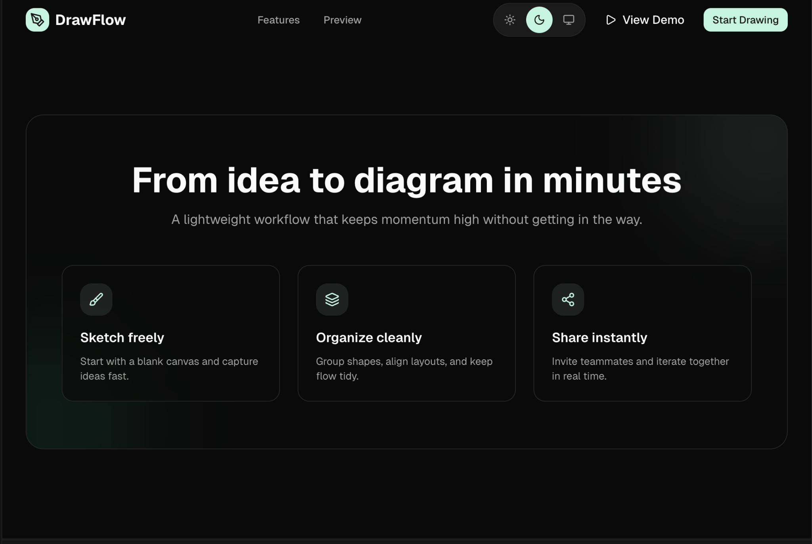 |

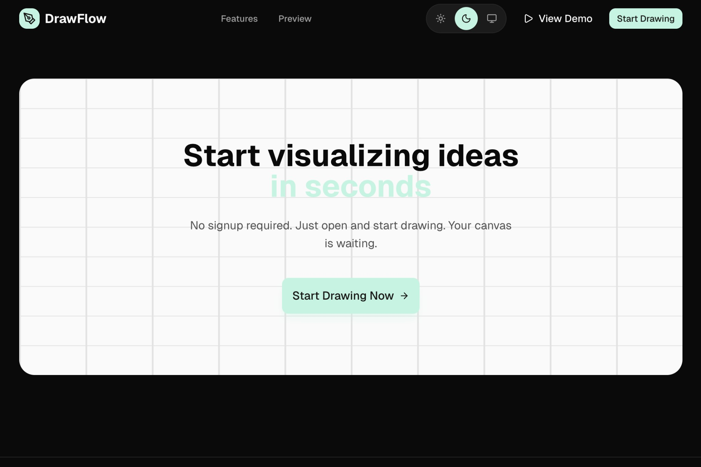

**Canvas**

| | |
|---|---|
| 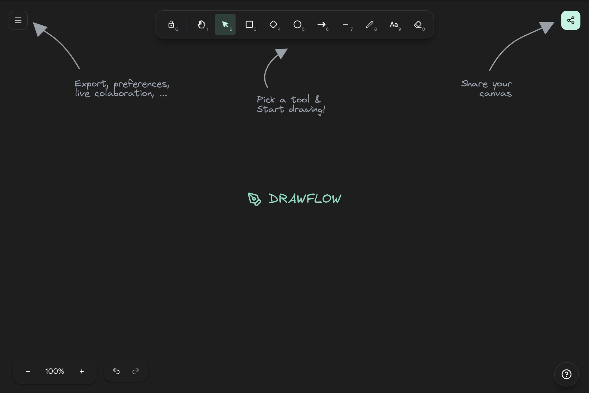 | 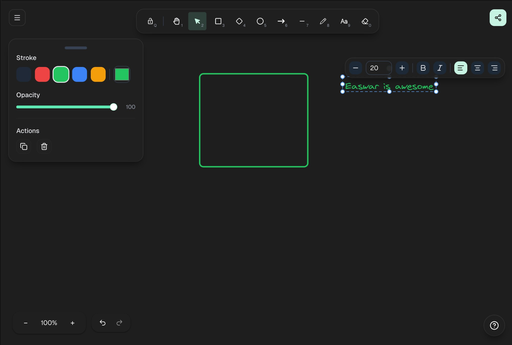 |
| 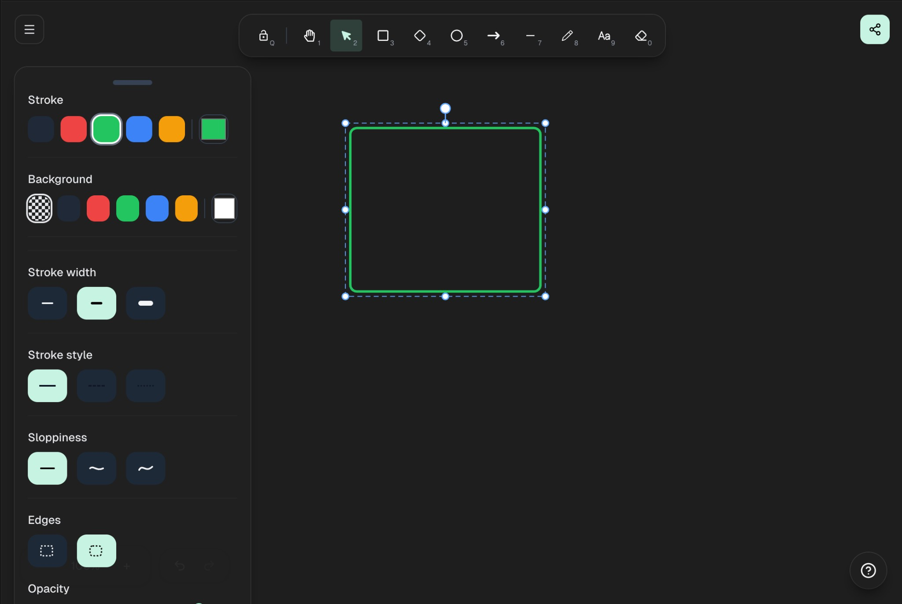 | 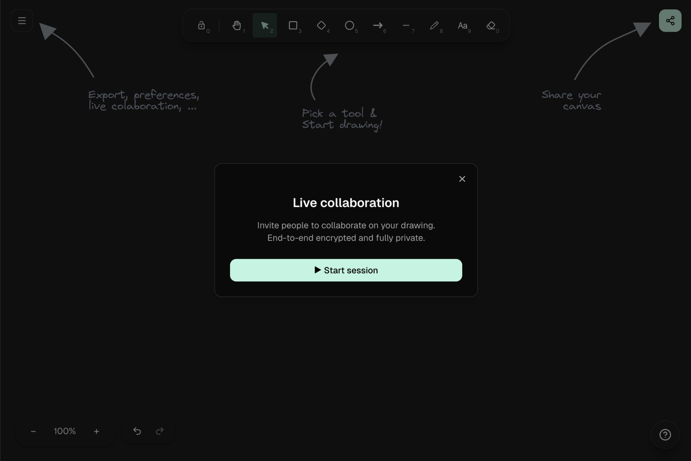 |
| 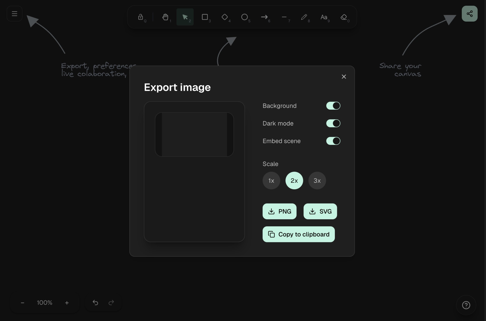 | 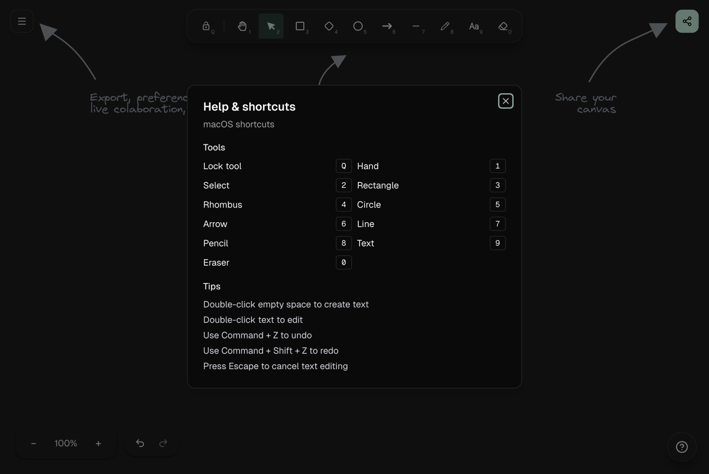 |

## Repository Structure

```
DrawFlow/
├── apps/
│   ├── web/          # Next.js web client
│   └── websocket/    # WebSocket collaboration server
├── packages/
│   ├── ui/           # Shared UI components
│   ├── eslint-config/
│   └── typescript-config/
├── turbo.json
└── pnpm-workspace.yaml
```

## Getting Started

### Prerequisites

- Node.js >= 18
- pnpm 9+
- Redis (optional — needed for collaborative persistence)

### Setup

```bash
# Install dependencies
pnpm install

# Configure environment
cp sampleENV.text .env
# Edit .env as needed (defaults work for local dev)

# Start all apps
pnpm dev
```

The web client runs on **http://localhost:3000** and the WebSocket server on **ws://localhost:8080**.

### Environment Variables

| Variable | Default | Description |
|----------|---------|-------------|
| `NODE_ENV` | `development` | Environment mode |
| `NEXT_PUBLIC_WS_URL` | `ws://localhost:8080` | WebSocket server URL |
| `NEXT_PUBLIC_HTTP_URL` | `http://localhost:3000` | HTTP backend URL |
| `REDIS_URL` | `redis://localhost:6379` | Redis connection string |

## Scripts

| Command | Description |
|---------|-------------|
| `pnpm dev` | Run all apps in development mode |
| `pnpm build` | Build all apps |
| `pnpm lint` | Lint all apps |
| `pnpm check-types` | Typecheck all apps |
| `pnpm format` | Format code with Prettier |

### Running Apps Individually

```bash
pnpm --filter web dev        # Web client only
pnpm --filter websocket dev  # WebSocket server only
```

## Notes

- If Redis is not running, the WebSocket server will still start but collaborative shape persistence will be disabled.
- The web client expects the WebSocket server to be available at `NEXT_PUBLIC_WS_URL`.
